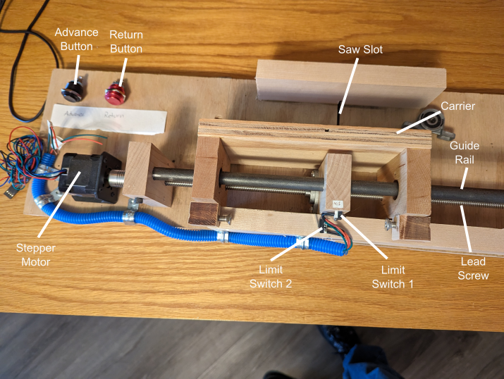

# Box Joint Machine

Like many woodworkers, I build Matthais Wandel's [Screw Advance Box Joint Jig](https://woodgears.ca/box_joint/jig.html). It's a wonderful tool, and I've built a lot of boxes using it. I want to do something similar for curio boxes, but this jig doesn't work well with the smaller sized pieces.

In the interest of shrinking the overall size, and because I enjoy electronics and automation, I decided to make the box computer controlled. A stepper motor allows accurate control, and an ATMega328p embedded computer costs about $3 at retail rates.

## The Machine

In operation, the sides of the box are clamped to the front of the carrier, with the edges to be joined flat to the base. 

1. The jig is pushed into the saw blade, and a 1/8" cut is made. 
2. The jig is pulled back.
3. The advance button is pushed.
4. The carrier moves 1/4" to the right (twice the width of the cut).

This continues until the left edge of the stock clears the cut line, or the stop screw on the left of the carrier closes Limit Switch 2.

When the Return button is pressed, the carrier will be pulled to the left until the stop screw on the right of the carrier closes Limit Switch 1.

The stop screws can be used to make fine adjustments to the stop positions.

## Software Requirements

Based on this operation, we can come up with the software requirements to control the device.

When reading button presses, it is important to debounce the button. That may be done electrically or through software.

### Pressing Advance Moves the Carrier 1/4" Right

Advance to the right is acheived by turning the lead screw counter-clockwise. Each full rotation of the screw should advance the carrier 2mm, and the motor is believed to be a 200 steps to the turn. Actual movement can be tested using a dial indicator against the carrier.

The screw should not be advanced if Limit Switch 2 is closed. This can damage the machine. This should be checked at each step.

### Pressing Return Moves the Carrier to the Left Edge

When the Return button is pressed, it moves the carrier continuously left until Limit Switch 1 is closed.

At each step Limit Switch 1 should be checked to ensure that it is not closed, to avoid damaging the machine.

## Microcontroller

Because they are cheap an ubiquitous, this will be driven by an [ATMega328p](https://ww1.microchip.com/downloads/en/DeviceDoc/Atmel-7810-Automotive-Microcontrollers-ATmega328P_Datasheet.pdf) microcontroller. It is possible that once the final form of the device is know, the machine could be driven by a smaller controller like an ATtiny45, but such devices are limited to six input/output pins, and even in this earliest stage the machine is using two outputs and four inputs.

## Switch Debouncing

For industrial control debouncing is particularly important. As a first pass, debounce will be managed by an [RC net debouncer](https://hackaday.com/2015/12/09/embed-with-elliot-debounce-your-noisy-buttons-part-i/) and use of pull-up resistors on the input pins, meaning that a closed circuit will give a LOW signal on the input pin. Information on how to set the ports for input with a pull-up resistor is on page 59 of the guide linked above. 